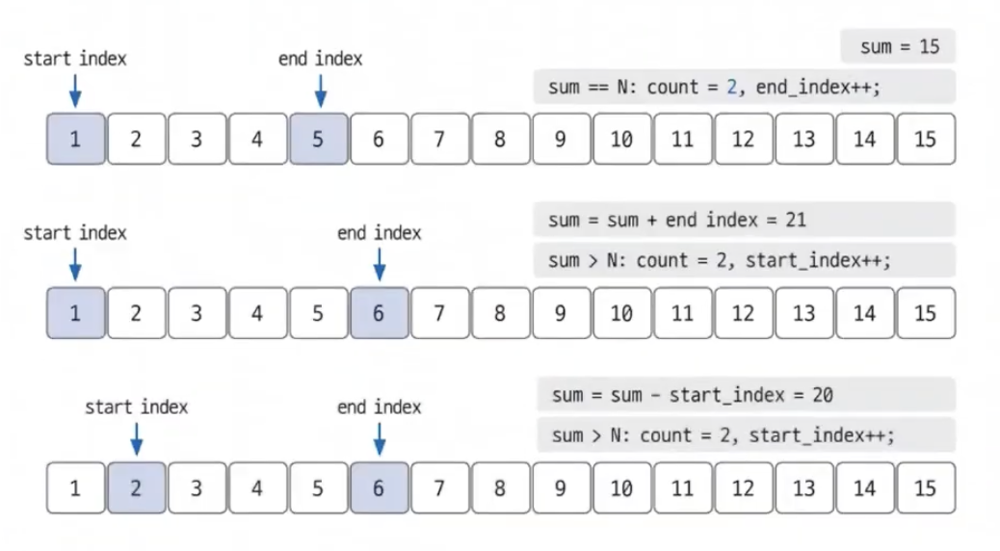
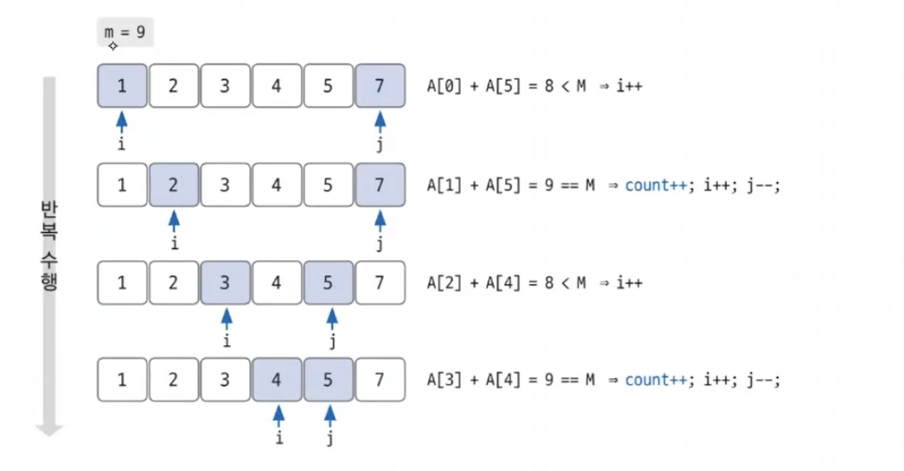

# 03-3 투 포인터

인덱스 또는 위치에 해당하는 포인터 또는 값을 만들고 특정 조건을 기준으로 시작, 끝 또는 중간으로 이동합니다
공간 복잡성을 최소화하면서도 문제를 해결하는 데 매우 효율적입니다

## 006 연속된 자연수의 합

https://www.acmicpc.net/problem/2018

어떤 자연수 N(1 ≤ N ≤ 10,000,000)에 대해서, 이 N을 몇 개의 연속된 자연수의 합으로 나타내는 가지수 구하기

### 풀이과정

1. 변수 초기화

   ```js
   let startIndex = 1;
   let endIndex = 1;
   let count = 1; // 자기자신 포함
   ```

2. 경우의 수 계산
   

```js
while (endIndex !== n) {
  // 정답일 때, 경우의 수 1 증가 & end포인터 우로 이동
  if (sum === n) {
    count++;
    endIndex++;
    sum += endIndex;
  }

  // n보다 클 때, start포인터 우로 이동
  if (sum > n) {
    sum -= startIndex;
    startIndex++;
  }
  // n보다 작을 때, end포인터 우로 이동
  if (sum < n) {
    endIndex++;
    sum += endIndex;
  }
}
```

## 007 주몽

https://www.acmicpc.net/problem/1940

### 풀이과정

1. 배열 오름차순 정렬
   JavaScript의 기본 sort() 메서드는 문자열로 변환 후 사전식으로 정렬합니다. 숫자 배열을 올바르게 정렬하려면 비교 함수를 제공해야 합니다.

```js
const arr = arrString
  .split(" ")
  .map(Number)
  .sort((a, b) => a - b);
```

2. 포인터 양 끝에서 이동
   

   ```js
   while (startIndex < endIndex) {
     const sum = arr[startIndex] + arr[endIndex];

     if (sum === target) {
       result++;
       startIndex++;
       endIndex--;
     }

     if (sum < target) {
       startIndex++;
     }

     if (sum > target) {
       endIndex--;
     }
   }
   ```

## 008 '좋은 수' 구하기 ✨

https://www.acmicpc.net/problem/1253

### 풀이과정

1. 배열 정렬

```js
const arr = input[1]
  .split(" ")
  .map(Number)
  .sort((a, b) => a - b);
```

2. 자기자신 제외

- if문으로 자기자신일 경우 포인터를 이동시키는 방법 (책 풀이)

  ```js
  if (sum === target) {
    if (i !== k && j !== k) {
      result++;
      break;
    } else if (i === k) {
      i++;
    } else if (j === k) {
      j--;
    }
  }
  ```

- 아래와 같이 slice를 사용하여 자기 자신을 제외시키는 방법 ✨
  ```js
  const newArr = [...arr.slice(0, k), ...arr.slice(k + 1)];
  ```

3. 포인터 이동

   ```js
   for (let k = 0; k < N; k++) {
     const newArr = [...arr.slice(0, k), ...arr.slice(k + 1)];
     const target = arr[k];
     let i = 0;
     let j = N - 2;

     while (i < j) {
       const sum = newArr[i] + newArr[j];

       if (sum === target) {
         result++;
         break;
       }

       if (sum > target) {
         j--;
       }

       if (sum < target) {
         i++;
       }
     }
   }
   ```
